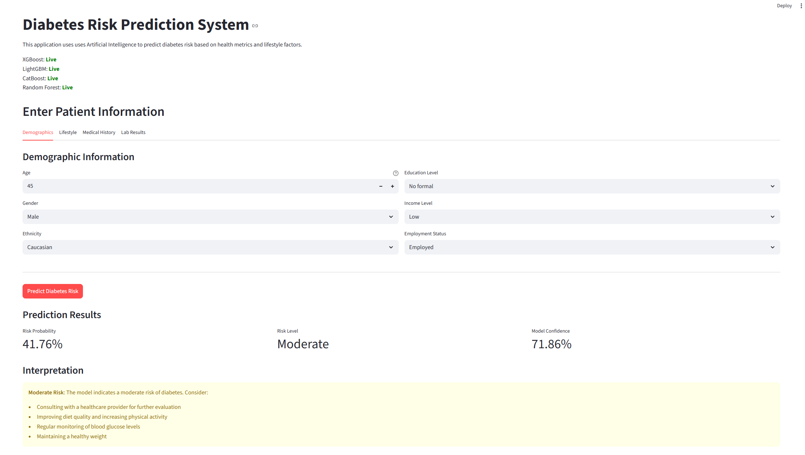

# Diabetes Prediction



This repository contains a machine learning solution for diabetes prediction using the [Kaggle Playground Series - Season 5, Episode 12](https://www.kaggle.com/competitions/playground-series-s5e12/) competition dataset. The project involves comprehensive data analysis, feature engineering, model training with ensemble methods, and hyperparameter optimization to achieve optimal predictive performance.

## Overview

The goal of this project is to build an accurate diabetes prediction model by:

- Exploring and analyzing the provided dataset
- Implementing advanced feature engineering techniques
- Training and tuning multiple machine learning models (XGBoost, LightGBM, CatBoost)
- Creating ensemble models for improved predictions
- Addressing class imbalance using SMOTE
- Evaluating performance on both public and private leaderboards

The repository includes Jupyter notebooks for data analysis and model development, saved models, and detailed reports of Kaggle submissions and optimization results.

## Setup Instructions

To set up the project on your local machine, follow these steps:

1. **Clone the repository:**

   ```bash
   git clone https://github.com/Sandakan/Diabetes-Prediction.git
   cd Diabetes Prediction
   ```

2. **Set up a Python virtual environment:**

   ```bash
   python -m venv venv
   source venv/bin/activate
   ```

3. **Install the required dependencies:**

   ```bash
   pip install -r requirements.txt
   ```

4. **Download the dataset:**
   - Visit the [Kaggle competition page](https://www.kaggle.com/competitions/playground-series-s5e12/).
   - Download the dataset and place the files in the `data/` directory.

5. **Verify the setup:**
   Ensure that the `data/` directory contains the `train.csv` and `test.csv` files.

## Project Structure

```txt
Diabetes Prediction/
├── data/                           # Dataset files (train.csv, test.csv)
├── figures/                        # Generated visualizations and plots
├── models/                         # Trained and saved models
├── notebooks/
│   ├── data_analysis.ipynb         # Exploratory data analysis
│   └── final.ipynb                 # Model training and evaluation
├── reports/
│   ├── kaggle_results.md           # Kaggle submission results and scores
│   └── scalar_vs_smote_scale_pos_weight_results.md  # Comparison of scaling and class balance techniques
├── app.py                          # Streamlit web application
├── requirements.txt                # Python dependencies
└── README.md                       # Project documentation
```

## Dataset

The dataset comes from the [Kaggle Playground Series - Season 5, Episode 12](https://www.kaggle.com/competitions/playground-series-s5e12/) competition and contains features for predicting diabetes. The dataset includes:

- **train.csv**: Training data with features and target labels
- **test.csv**: Test data for generating predictions

## Key Techniques Used

- **Model Ensembling**: Combining XGBoost, LightGBM, and CatBoost for robust predictions
- **Feature Engineering**: Creating advanced features to improve model performance
- **Class Imbalance Handling**: SMOTE (Synthetic Minority Over-sampling Technique) implementation
- **Hyperparameter Optimization**: Tuning XGBoost parameters for better accuracy
- **Data Preprocessing**: Standardization and feature scaling

## Results

Detailed Kaggle leaderboard results and performance comparisons can be found in:

- [kaggle_results.md](reports/kaggle_results.md) - Complete submission history with scores
- [scalar_vs_smote_scale_pos_weight_results.md](reports/scalar_vs_smote_scale_pos_weight_results.md) - Analysis of different scaling and balancing techniques

## Usage

### Training Models

1. **Data Analysis**: Start with `notebooks/data_analysis.ipynb` to explore the dataset
2. **Model Development**: Use `notebooks/final.ipynb` for model training, optimization, and evaluation
3. **Export Models**: Run the final cells in `notebooks/final.ipynb` to export trained models to `models/` directory
4. **View Results**: Check the `reports/` directory for detailed analysis and Kaggle submission results

### Streamlit Web Application

The project includes an interactive web application for real-time diabetes risk prediction using the trained ensemble model.

#### Running the Web App

1. **Train and export models** (if not already done):
   - Open `notebooks/final.ipynb`
   - Run all cells to train models
   - Execute the model export cell to save artifacts to `models/` directory

2. **Launch the Streamlit app**:

   ```bash
   streamlit run app.py
   ```

3. **Access the application**:
   - The app will open in your default browser (usually at `http://localhost:8501`)
   - If not, navigate to the URL shown in the terminal

#### Web App Features

- **Interactive Input Forms**: Organized tabs for demographics, lifestyle, medical history, and lab results
- **Input Validation**: Real-time validation ensuring all values are within medically reasonable ranges
- **Automatic BMI Calculation**: Height and weight inputs automatically calculate BMI
- **Weighted Ensemble Prediction**: Uses XGBoost, LightGBM, CatBoost, and Random Forest models
- **Risk Assessment**: Categorizes risk as Low, Moderate, or High with probability scores
- **Model Transparency**: Displays ensemble weights and model performance metrics
- **User-Friendly Interface**: Tooltips and help text for all medical metrics

#### Input Sections

The web app is organized into **4 tabs** for easy navigation:

**Demographics**

- Age, Gender, Ethnicity
- Education level, Income level, Employment status

**Lifestyle**

- Physical activity (minutes/week)
- Diet quality score, Sleep hours
- Smoking status, Alcohol consumption, Screen time

**Medical History**

- Family history of diabetes, Hypertension history, Cardiovascular history
- Height (cm) and Weight (kg) → **Automatic BMI calculation**

**Lab Results**

- Blood pressure (systolic/diastolic)
- Heart rate, Waist-to-hip ratio
- Cholesterol panel (total, HDL, LDL, triglycerides)

#### App Architecture

The Streamlit app (`app.py`) implements:

1. **Feature Engineering Pipeline**: Replicates the exact 17 advanced features from training
2. **Preprocessing Steps**:
   - Ordinal encoding for education and income levels
   - One-hot encoding for nominal categorical features
   - StandardScaler normalization
   - Feature alignment with training columns

3. **Ensemble Prediction**:
   - Loads all 4 trained models (XGBoost, LightGBM, CatBoost, Random Forest)
   - Applies weighted averaging based on validation ROC-AUC scores
   - Returns probability of diabetes diagnosis

4. **Input Validation**:
   - Age: 18-100 years
   - Height: 100-250 cm, Weight: 30-250 kg
   - Blood Pressure: Systolic 70-250, Diastolic 40-150 mmHg
   - Cholesterol: Medically reasonable ranges
   - Activity, sleep, diet: Realistic bounds

## Model Performance

The weighted ensemble model achieves:

- **Validation ROC-AUC**: 0.7915
- **Accuracy**: 71.75%
- **Precision**: 70.95%
- **Recall**: 83.22%
- **F1-Score**: 76.60%

Individual model contributions to the ensemble are weighted based on their ROC-AUC scores.

## License

This project is licensed under the MIT License. See the LICENSE file for details.
